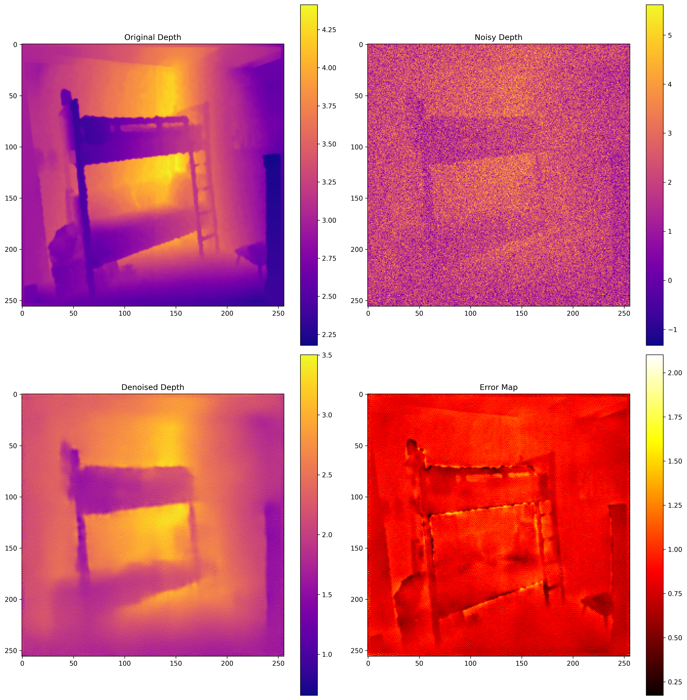

# DiffusionNeRF-3D

A novel approach to 3D scene reconstruction combining diffusion models with Neural Radiance Fields (NeRF). This project implements a two-stage pipeline that first uses a diffusion model to refine depth maps from RGBD images, which are then used by a memory-efficient NeRF model for high-quality 3D scene reconstruction.

## 🚧 Project Status: Active Development

This project is currently under active development with ongoing research and improvements. Recent achievements include:
- ✅ Implemented and trained diffusion model for depth refinement
- ✅ Developed memory-efficient NeRF with depth supervision
- ✅ Created initial integration pipeline
- ✅ Achieved promising early results in depth refinement

Latest Diffusion Model Metrics:
```
MSE: 0.8901
PSNR: 0.7254
```

## Technical Implementation

### Diffusion Model
- **Architecture**: UNet backbone with:
  - Multi-scale feature processing
  - Attention mechanisms at bottleneck
  - Residual connections
  - Feature enhancement blocks
  - Group normalization for stable training
- **Training**: 
  - Cosine noise scheduling
  - Edge-aware loss function
  - Multi-view consistency loss
  - Perceptual loss for better feature preservation

### NeRF Implementation
- **Core Features**:
  - Hash encoding for faster training
  - Occupancy grid acceleration
  - Memory-efficient ray sampling
  - View-dependent effects
  - Depth supervision from diffusion model
- **Optimizations**:
  - Gradient checkpointing
  - Mixed precision training
  - Memory-efficient data loading
  - Dynamic batch sizing

### Depth Refinement Results

*Depth map refinement process showing: (top-left) original depth, (top-right) noisy input, (bottom-left) denoised output, and (bottom-right) error map. The model effectively preserves structural details while removing noise.*

## Project Structure
```
.
├── configs/               # Configuration files
├── data/                  # Data handling and datasets
├── scripts/              # Training and evaluation scripts
├── src/                  # Source code
│   ├── data/            # Data loading and processing
│   ├── models/          # Model architectures
│   │   ├── diffusion.py       # Diffusion model
│   │   ├── nerf.py           # NeRF implementation
│   │   ├── optimizations.py  # Performance optimizations
│   │   └── unet.py          # UNet architecture
│   ├── rendering/       # Volumetric rendering
│   └── utils/           # Utility functions
└── visualizations/       # Output visualizations
```

## Setup

1. Clone the repository:
```bash
git clone https://github.com/yourusername/DiffusionNeRF-3D.git
cd DiffusionNeRF-3D
```

2. Install requirements:
```bash
pip install -r requirements.txt
```

3. Download the NYU Depth V2 dataset and place it in `data/raw/nyu_depth_v2/`

## Training

1. Train the diffusion model:
```bash
python scripts/train_diffusion.py
```

2. Train the NeRF model:
```bash
python scripts/train_nerf.py
```

## Ongoing Development

- [ ] Implementing InstantNGP techniques
- [ ] Adding sparse voxel grid acceleration
- [ ] Creating interactive 3D viewer
- [ ] Adding real-time visualization capabilities
- [ ] Improving multi-view consistency
- [ ] Optimizing memory usage further
- [ ] Enhancing depth refinement quality

## License

[Add your chosen license]

## Acknowledgements

This project uses the NYU Depth V2 dataset for training and evaluation.